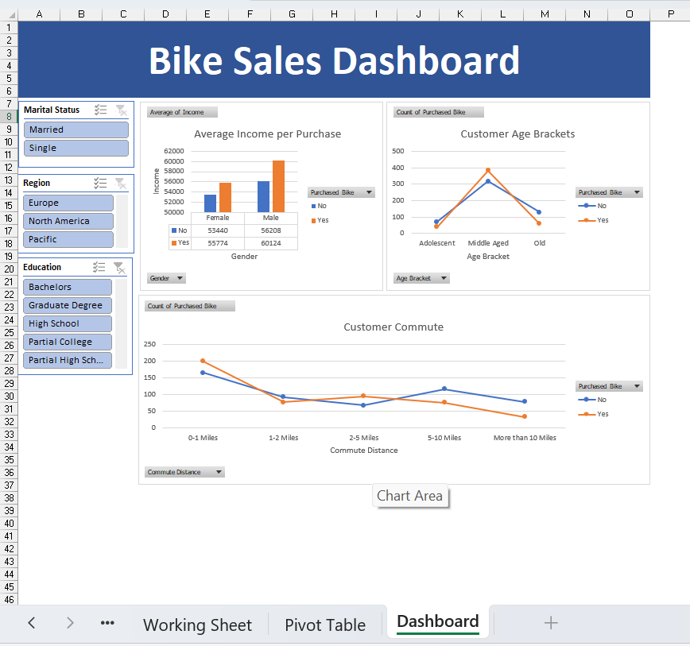
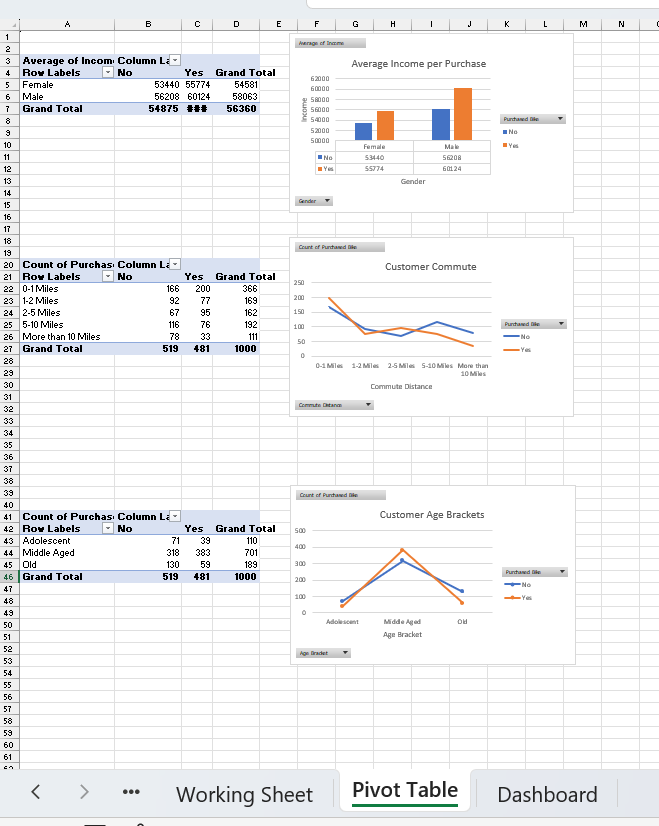
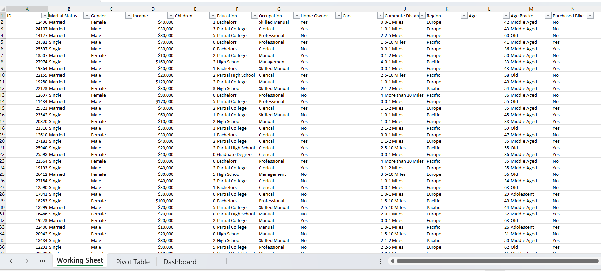

# Bike Sales Dashboard (Excel)

## 📌 Overview

This project presents an interactive Excel dashboard analyzing bike purchase behavior using customer demographic and behavioral data.

The dashboard was built using Excel pivot tables, charts, slicers, and dashboard design techniques to uncover customer purchasing patterns and business insights.

---

## 🎯 Objectives

* Analyze customer income and bike purchase behavior
* Understand customer demographics and commute trends
* Explore purchasing behavior across age brackets and regions
* Create an interactive dashboard using Excel tools

---

## 🛠️ Tools Used

* Microsoft Excel
* Pivot Tables
* Pivot Charts
* Slicers
* Dashboard Design

---

## 📊 Dashboard Features

* Average Income per Purchase
* Customer Age Brackets Analysis
* Customer Commute Analysis
* Region-Based Filtering
* Education-Based Filtering
* Marital Status Filtering

---

## 📸 Dashboard Preview

### Excel Dashboard

---

### Pivot Table Analysis

---

### Raw Data Working Sheet

---

## 🚀 Key Insights

* Middle-aged customers showed higher bike purchasing activity
* Customers with shorter commute distances demonstrated stronger purchasing behavior
* Income levels varied between customers who purchased bikes and those who did not
* Regional and educational factors influenced purchasing patterns

---

## 📁 Project Files

* `Bike_Sales_Excel_Dashboard.xlsx`
* Dashboard screenshots
* README documentation

---

## 📬 Contact

* LinkedIn: www.linkedin.com/in/muhammedshifin

---
